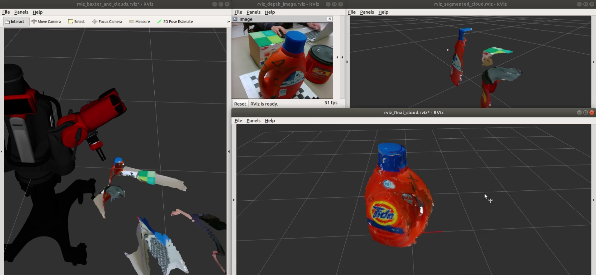
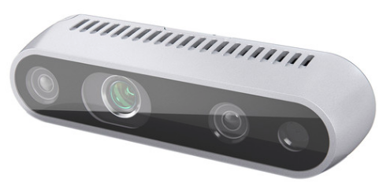
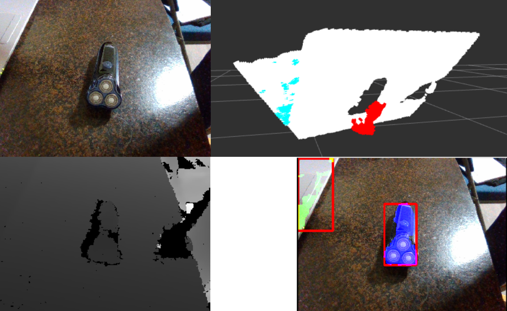
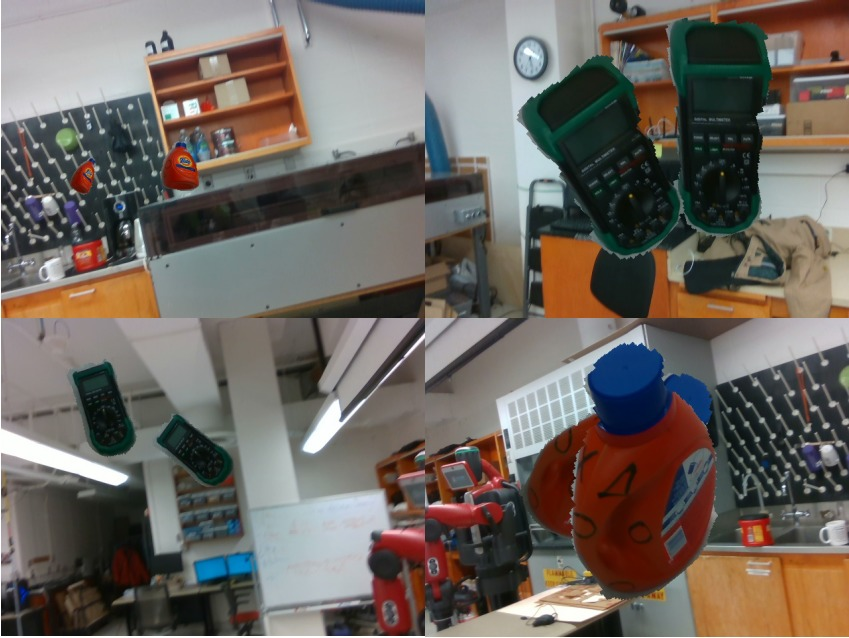

Winter Project at Northwestern University
===================

**Feiyu Chen**  
**2019. Mar 22th**

The goal of the project is to locate the 6D pose of an object from the RGB-D image. This task is divided into 4 components. I've completed the first 3 components as shown in following paragraphs.

# 1. Scann object's 3D model

Scan objects 3D point cloud model by Baxter robot and depth camera. 

See this Github:  
https://github.com/felixchenfy/3D-Scanner-by-Baxter

A figure and a GIF of scanning a bottle is shown below.  

    

# 2. Collect data for training Yolo

Use a depth camera to detect objects on table and get their mask in 2D image. The image and mask are used for training Yolo, which is a deep learning framework for object detection. 

See this Github:  
https://github.com/felixchenfy/Mask-Objects-from-RGBD

A figure of the image, point cloud, and the detected object and mask is shown below.

 
  

 
  

# 3. Train Yolo

The masked objects obtained in the last step were put onto different background images with random locations, scales, rotations, and shears to complete the data augmentation step. Then, these generated images are used for training Yolo.

See this Github:  
https://github.com/felixchenfy/Data-Augment-and-Train-Yolo

Four generated images are shown below.  

The final result of Yolo is shown below. Video are at here: [bottle](https://github.com/felixchenfy/Data-Storage/raw/master/Data-Augment-and-Train-Yolo/bottle_result.avi), [meter](https://github.com/felixchenfy/Data-Storage/raw/master/Data-Augment-and-Train-Yolo/bottle_result.avi).

|Bottle |Meter |
|:---:|:---:|
||  |

# 4. Locate object 6D pose

(TODO)

Since I've get the object's 3D model and its 2D pos in RGB image, I can locate the object's 6D pose by fitting the 3D model onto the RGB-D image.

